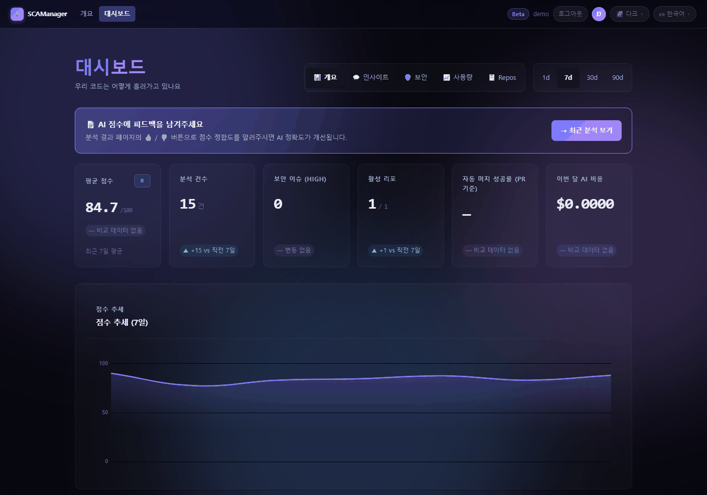

<div align="center">

# 🛡️ SCAManager

**GitHub push·PR 마다 정적 분석 + Claude AI 리뷰 — 점수화·알림·게이트.**

[](https://github.com/xzawed/SCAManager/actions/workflows/ci.yml)
[](https://github.com/xzawed/SCAManager/actions/workflows/codeql.yml)
[-brightgreen?style=flat-square&logo=pytest&logoColor=white)](tests/)
[](e2e/)
[](src/)
[](https://fastapi.tiangolo.com/)
[](LICENSE)

[🇺🇸 English](README.md)

</div>

GitHub 리포지토리 하나를 등록하면, 그 뒤로 모든 push 와 PR 이 분석돼 100점으로 채점되고 —
맡기면 — 승인·머지되거나 변경 요청으로 되돌아간다. 내 서버나 내 Railway 프로젝트에서 돈다.
호스팅 서비스가 아니다.

## 무엇을 얻나

**분석** — 정적 분석기 25종이 27개 언어를 보고, Claude 리뷰가 언어별 체크리스트(49개)를 따른다.
설치하기로 계약한 분석기가 없으면 분석을 incomplete 로 표시하고 auto-merge 를 막는다 —
아무것도 안 돌고 높은 점수를 받는 일이 없도록.

<sub>c · clojure · cpp · csharp · css · dart · dockerfile · elixir · go · html · java · javascript ·
kotlin · php · powershell · protobuf · python · ruby · rust · scala · shell · solidity · sql ·
swift · terraform · typescript · yaml</sub>

**점수** — 커밋마다 100점 만점 점수와 등급. 저장되고 추세로 보인다.

**웹 UI** — 대시보드 · 리포별 이력 · 분석 상세 · 설정. **한국어 · English · 日本語**, 테마 4종.

**게이트** — 점수에 따라 PR 승인 · 변경 요청 · squash 머지. 리포마다 켜기 전까지는 꺼져 있다.

**알림** — Telegram · Discord · Slack · Email · webhook · n8n ·
GitHub 커밋 코멘트 · GitHub 이슈. 리포마다 따로 설정한다.


<div align="center">

<!-- 재생성 / regenerate: py -3 scripts/capture_readme_hero.py -->


<sub>7일치 이력을 심어 둔 로컬 인스턴스 — 처음 띄웠을 때의 화면이 아니다.
AI 비용이 $0.00 인 것은 시드가 실제 API 를 호출하지 않기 때문이다.</sub>

</div>

## 빠른 시작

```bash
git clone https://github.com/xzawed/SCAManager.git && cd SCAManager
make install         # pip install -r requirements-dev.txt + npm install
make css-build       # Tailwind 번들 (gitignore 대상 — 한 번 빌드한다)
cp .env.example .env
make run             # uvicorn :8000, 부팅 시 마이그레이션
```

`make` 이 없으면 각 타깃은 한두 줄짜리다 — [Makefile](Makefile) 에서 읽어 쓴다.

`.env.example` 은 DB·Telegram 에 placeholder 를 담고 있지만 **`SESSION_SECRET` 은 비어 있고,
비어 있으면 부팅을 거부한다** — `openssl rand -hex 32` 로 만든다. `ANTHROPIC_API_KEY` 도 넣는다.
없으면 모든 점수의 AI 몫이 중립 기본값으로 떨어진다. 아래의 GitHub 로그인에는 OAuth 앱의
`GITHUB_CLIENT_ID` · `GITHUB_CLIENT_SECRET` 이 필요하다. CLI 만 쓸 때만 비워 둔다.

<http://localhost:8000> 을 열고 GitHub 으로 로그인한 뒤 **+ 리포 추가** 를 고른다. 웹훅이 등록되고
그 리포의 다음 push 부터 분석된다. 어떤 채널로 보낼지, 게이트가 스스로 행동할지는 리포마다
정한다 — 리포 페이지의 **⚙️ 설정**.

**서버 없이** push 전에 작업 트리를 검토하려면:

```bash
python -m src.cli review --base main   # 또는 --staged
python -m src.cli review --json        # --no-ai 는 Claude 호출을 건너뛴다
```

## 파이프라인

```
POST /webhooks/github — HMAC-SHA256 · 리포별 시크릿 · push, PR opened/synchronize/reopened
 └─ gather   정적 분석기 + Claude 리뷰
    score    calculate_score() → DB
    gate     PR approve · request changes · Telegram 버튼 · squash merge
    notify   리포별 채널
```

## 점수

100점 만점 — 코드 품질 25 (error −3 · warning −1) · 보안 20 (HIGH −7 · LOW/MEDIUM −2) ·
커밋 메시지 15 · 구현 방향성 25 · 테스트 코드 15. 뒤 3항은 AI 리뷰가 준다.
등급 **A** 90+ · **B** 75+ · **C** 60+ · **D** 45+ · 미만 **F**.

AI 리뷰가 쓸 수 있는 결과를 못 내면 그 3항이 중립값으로 떨어져, 정적 분석이 만점이어도
89점 — B 에서 멈춘다. 진짜 API·파싱 오류면 점수를 아예 저장하지 않는다.

## 게이트·전달

기본값은 75+ approve · 50 미만 request changes · 75+ squash merge 이고, 두 행동 모두 꺼진 채
출고된다. `approve_mode=auto` 는 GitHub 에 즉시
반영하고, `semi-auto` 는 Telegram 버튼으로 먼저 묻는다. 둘 다 리포마다 정한다.
CI 대기로 실패한 머지는 큐에 넣어 재시도한다.

알림 채널은 서로 독립이라 웹훅 하나가 깨져도 나머지는 나간다.

## 배포

**Railway** — 리포 연결 · PostgreSQL 플러그인 추가 · 위 변수들 + `ANTHROPIC_API_KEY` +
`https://` `APP_BASE_URL`. `http://` 면 OAuth 리다이렉트와 웹훅 전달이 둘 다 실패한다
([런북](docs/runbooks/railway.md)).

**온프레미스** — `uvicorn src.main:app --host 0.0.0.0 --port 8000 --proxy-headers`.

셀프 호스팅이지 밀폐는 아니다 — diff 와 점수는 GitHub · 내 DB · Anthropic · 켠 채널에 닿는다.
전체 표와 끄는 법: [SECURITY.md](SECURITY.md#data-egress).

## 문서

[아키텍처](docs/architecture.md) · [환경변수](docs/reference/env-vars.md) ·
[런북](docs/runbooks/) · [기여](CONTRIBUTING.md) · [현재 수치](docs/STATE.md)

취약점은 [비공개 advisory](https://github.com/xzawed/SCAManager/security/advisories/new) 로,
공개 이슈로는 열지 않는다. [MIT](LICENSE) © xzawed
