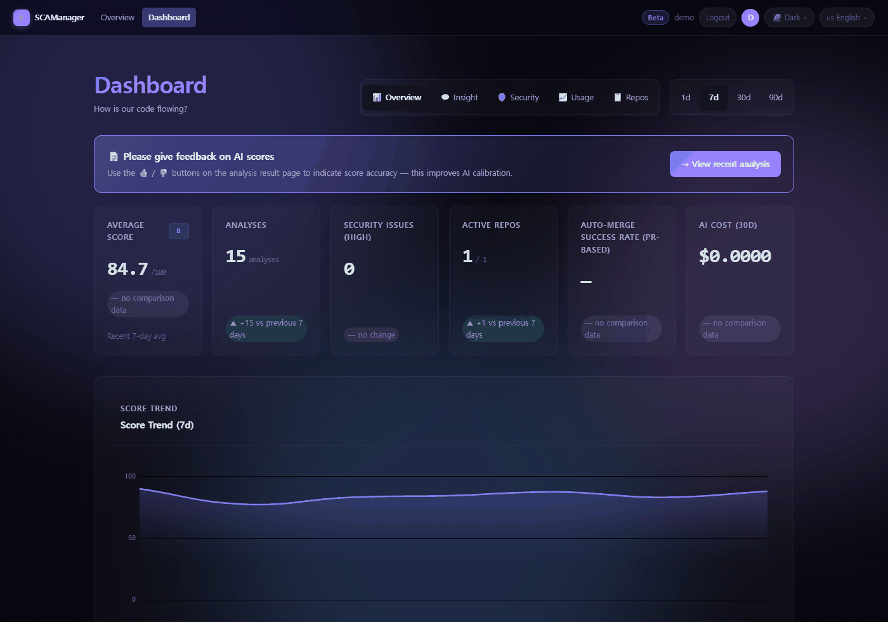

<div align="center">

# 🛡️ SCAManager

**Static analysis + Claude AI review on every GitHub push and PR — scored, notified, gated.**

[](https://github.com/xzawed/SCAManager/actions/workflows/ci.yml)
[](https://github.com/xzawed/SCAManager/actions/workflows/codeql.yml)
[-brightgreen?style=flat-square&logo=pytest&logoColor=white)](tests/)
[](e2e/)
[](src/)
[](https://fastapi.tiangolo.com/)
[](LICENSE)

[🇰🇷 한국어](README.ko.md)

</div>

## What is this?

SCAManager watches a GitHub repository. Every time someone pushes a commit or opens a pull
request, it runs static analyzers over the changed files, asks Claude to review the diff, turns
both into a single score out of 100, and tells you about it.

If you want it to, it can also act on that score by itself — approve the pull request, ask for
changes, or squash-merge it.

**You run it yourself.** There is no service to sign up for and no account to create. It lives on
your laptop, your server, or your own Railway project, and it talks to GitHub and Anthropic using
your own credentials. The Claude usage is billed to your Anthropic account, not to anyone else.

**It might be for you if** you review pull requests on GitHub, you want a consistent second
opinion on every one of them, and you would rather not hand your code to someone else's hosted
service to get it.

<div align="center">

<!-- 재생성 / regenerate: py -3 scripts/capture_readme_hero.py -->


<sub>A local instance with seven days of seeded history — this is not what first boot looks like.
The AI cost card reads $0.00 because the seed data never called the API.</sub>

</div>

## What it does to your repository

This is the part worth reading before you install anything. Some of it starts the moment you add
a repository; the rest stays off until you switch it on.

| | What happens | Default |
|---|---|---|
| **Analyze and score** | Every push and pull request is analyzed and scored. The result is stored and shown in the web UI. | **On** |
| **AI review** | Claude reviews the diff. Each review is a Claude API call billed to your Anthropic account — skipped when there is no key, the feature is off, or the diff is empty. | **On** |
| **PR review comment** | The review is posted as a comment on the pull request. | **On** |
| **Notifications** | Telegram, Discord, Slack, email, webhook, n8n, GitHub commit comment, GitHub issue. | Off — except Telegram, which is enabled as soon as a bot token and chat ID exist |
| **Approve / request changes** | Acts on GitHub for you, based on the score. | **Off** |
| **Squash-merge** | Merges the pull request once the score is high enough. | **Off** |

Every row is configured per repository, on that repository's **⚙️ Settings** page.

Two things happen once, when you add a repository, regardless of those settings: a **webhook is
installed** on it, and — for **private** repositories only — a small `.scamanager/` directory
(a config file and a CLI hook script) is **committed** to it. Public repositories do not get that
commit.

## Try it without touching GitHub

Before wiring anything up, you can run the same analysis over your working tree from the command
line. It reads local files and never calls GitHub:

```bash
python -m src.cli review --base main   # compare against a branch
python -m src.cli review --staged      # or just what you have staged
python -m src.cli review --no-ai       # skip Claude entirely — no API key needed
```

On Windows, use `py -3` in place of `python`.

## Running the server

### What you need first

| | |
|---|---|
| **Python 3.12** | The version CI runs. Newer usually works; 3.12 is what is tested. |
| **Node.js 20** | Only to build the CSS bundle, once. |
| **PostgreSQL** | A reachable database. SQLite is what the test suite uses; run the app on PostgreSQL. |
| **A GitHub OAuth app** | To sign in to the web UI. Not needed if you only want the CLI above. |
| **An Anthropic API key** | Optional — but without it there is no AI review, and no score can exceed 89. |

### Install and run

```bash
git clone https://github.com/xzawed/SCAManager.git && cd SCAManager
make install         # pip install -r requirements-dev.txt + npm install
make css-build       # builds the Tailwind bundle (gitignored, so build it once)
cp .env.example .env
make run             # uvicorn on :8000, database migrations run at boot
```

If `make` is not available — on Windows, for instance — each of those targets is one or two plain
commands. Open the [Makefile](Makefile), run the four above in order, and substitute `py -3` for
`python`.

### Filling in `.env`

`.env.example` ships with working example values for most settings, so the app boots as soon as
`DATABASE_URL` points at a real database. Three entries deserve attention before you use it for
anything real:

- **`SESSION_SECRET`** — generate one with `openssl rand -hex 32`. Left alone, the app runs on a
  publicly known development value and logs a warning; in production (an `https://` `APP_BASE_URL`,
  or `ENVIRONMENT=production`) it refuses to start instead.
- **`ANTHROPIC_API_KEY`** — without it there is no AI review, and no score can exceed 89.
- **`GITHUB_CLIENT_ID` and `GITHUB_CLIENT_SECRET`** — from a GitHub OAuth app, for signing in to
  the web UI.

Everything else is in [docs/reference/env-vars.md](docs/reference/env-vars.md).

### Adding your first repository

Open <http://localhost:8000>, sign in with GitHub, and choose **+ Add Repository**. That installs a
webhook on the repository (and, for private repositories, commits the `.scamanager/` files noted
above), and the next push is analyzed. From there, the repository's **⚙️ Settings** page decides
which notification channels are used and whether the gate may act on GitHub for you.

## How the score works

A commit starts at 100 points and is judged on five things:

| Part | Points | Where it comes from |
|---|---|---|
| Code quality | 25 | Static analyzers — each error costs 3, each warning 1 |
| Security | 20 | Static analyzers — each HIGH finding costs 7, each LOW or MEDIUM 2 |
| Commit message | 15 | Claude |
| Direction | 25 | Claude — does the change do what it claims, and is this a sensible way to do it |
| Tests | 15 | Claude |

**A** is 90 and above, **B** 75, **C** 60, **D** 45, and anything below that is **F**.

Claude is responsible for 55 of those 100 points. When there is no usable AI review — no API key,
the feature switched off, or an empty diff — those three parts are not zeroed. They are replaced
by fixed neutral values worth 44 of the 55, which is why a flawless static run then tops out at
**89**: a B, never an A. The run is also flagged as unverified, so a score that never saw an AI
review can be told apart from one that did.

If the AI call genuinely failed — an API error, or a response that could not be parsed — no score
is stored at all.

The static half works the same way. Every deployment installs 16 analyzers under a fixed
contract. If one of them is missing and it applies to a file in the current change, that analysis
is marked **incomplete**, and the gate will not auto-approve or auto-merge it. A run that could
not analyze what it was given should not be able to score well.

<details>
<summary><b>Language coverage</b> — 49 for the AI review, 27 with a static analyzer</summary>

<br>

Claude reviews **49 languages**, each against its own checklist. **27** of those also have a static
analyzer behind them. There are **25 registered analyzers**; **16** ship in every deployment as the
contract described above, and the rest run when their binary happens to be on `PATH`.

A local `make run` will not have all 25 available, and that is fine — a missing *optional* analyzer
is skipped quietly. [docs/STATE.md](docs/STATE.md) carries the current counts.

Languages with static analysis:

`c · clojure · cpp · csharp · css · dart · dockerfile · elixir · go · html · java · javascript ·
kotlin · php · powershell · protobuf · python · ruby · rust · scala · shell · solidity · sql ·
swift · terraform · typescript · yaml`

</details>

## The gate

The gate is the part that acts on GitHub for you. It is off when you add a repository and stays
off until you decide otherwise on the settings page.

Once enabled, the defaults are: approve at 75 or above, request changes below 50, squash-merge at
75 or above. Approving has two modes — `auto` acts on GitHub immediately, while `semi-auto` sends
a Telegram message with buttons and waits for your answer.

A merge that GitHub rejects because CI is still running is queued and retried, not dropped.

Notification channels are independent of one another, so a webhook that starts failing does not
stop the rest from being delivered.

## Deploying

**Railway** — connect the repository, add a PostgreSQL database, and set the variables above plus
`ANTHROPIC_API_KEY` and an `APP_BASE_URL`. That URL has to be `https://`; over plain `http://` both
the OAuth redirect and GitHub's webhook delivery fail. The
[runbook](docs/runbooks/railway.md) has the specifics.

**Anywhere else** — it is an ordinary ASGI application:

```bash
uvicorn src.main:app --host 0.0.0.0 --port 8000 --proxy-headers
```

## What leaves your machine

Running it yourself is not the same as nothing leaving your network. Your diffs and scores reach:

- **GitHub** — the review comment, the `.scamanager/` commit on private repositories, and any
  approve or merge you enable
- **Your own database** — scores, findings derived from the diff, and the AI review text
- **Anthropic** — the diff itself, for the review
- **Any notification channel you turn on** — score summaries
- **OpenAI** — only if you enable the optional second-opinion verifier

[SECURITY.md](SECURITY.md#data-egress) has the full table, and how to switch each one off.

## Documentation

[Architecture](docs/architecture.md) · [Environment variables](docs/reference/env-vars.md) ·
[Runbooks](docs/runbooks/) · [Contributing](CONTRIBUTING.md) · [Current numbers](docs/STATE.md)

Found a vulnerability? Please open a
[private advisory](https://github.com/xzawed/SCAManager/security/advisories/new) rather than a
public issue.

[MIT](LICENSE) © xzawed
